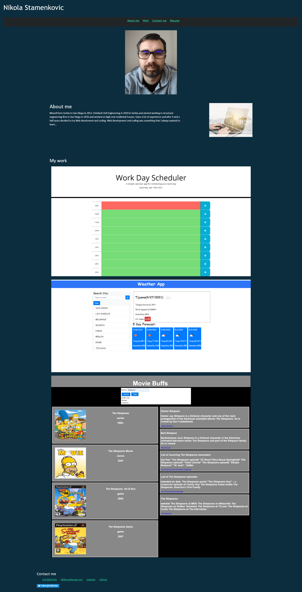

# 09_Portfolio

UCSD-SD-FSF-PT-03-2021-U-C-MW

[GitHub link](https://github.com/djony88/09_Portfolio)

[Published Webpage](https://djony88.github.io/09_Portfolio/)

Requirement:

* Updated Portfolio
* GitHub Profile
* Updated Resume
* Updated LinkedIn

HTML

* Added bootstrap.
* Added PDF resume which downloads when you click on Resume in navigation bar.
* Added Work day schedule app, Weather app and Group Project (Movie Buffs) to my work section.
* Updated Work samples with "on click" function on screenshot takes you to a GitHub deployed webpage.
* Updated contact with LinkedIn profile page, GitHub profile page and Twitter profile page.
* Added LinkedIn, GitHub and Twitter links into contact me section.
* Added Twitter script.
* Removed footer.

CSS

* Updated style to header and navigation bar.
* Updating picure of me. :) 
* Updating stylyng in About me section.
* Updating styling in My work section.
* Updating styling in My contact info.
* Removing footer styling.
* Adding media query for mobile responsiveness.

