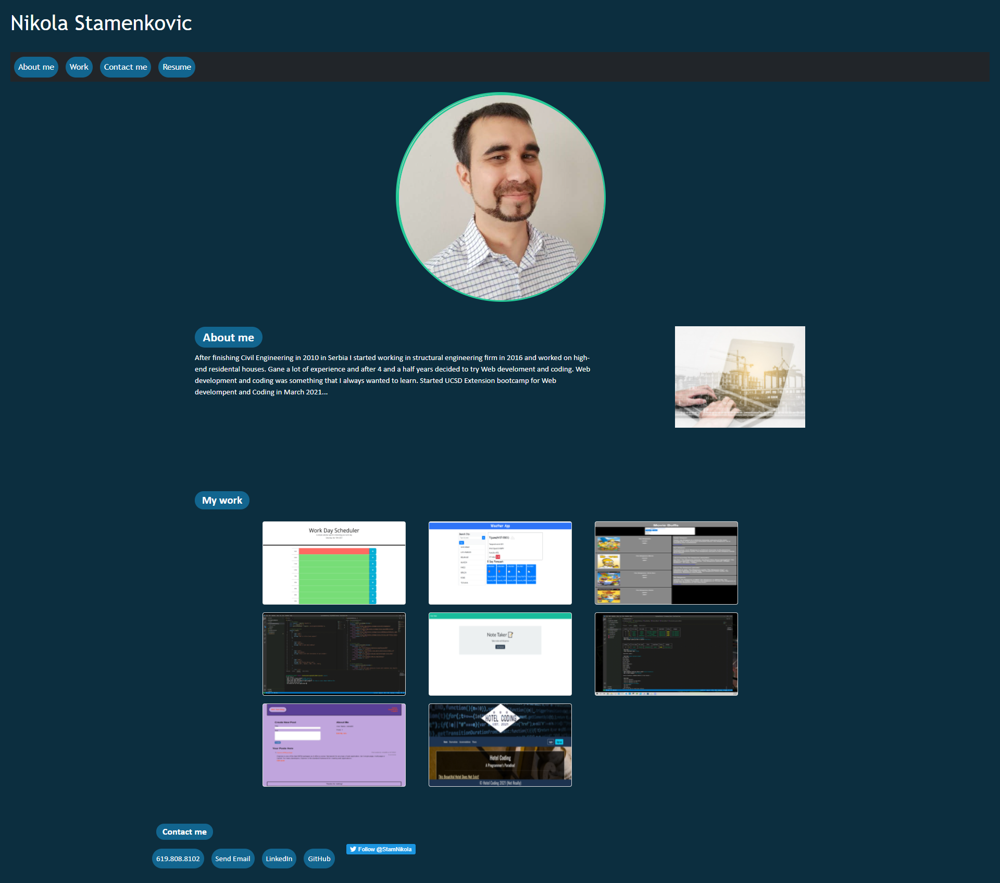

# 09_Portfolio

UCSD-SD-FSF-PT-03-2021-U-C-MW

[GitHub link](https://github.com/djony88/09_Portfolio)

[Published Webpage](https://djony88.github.io/09_Portfolio/)

Requirement:

* Updated Portfolio
* GitHub Profile
* Updated Resume
* Updated LinkedIn

* Updated Tweeter follow link

HTML

* Added bootstrap.
* Added PDF resume which downloads when you click on Resume in navigation bar.
* Added Work day schedule app, Weather app and Group Project (Movie Buffs) to my work section.
* Updated Work samples with "on click" function on screenshot takes you to a GitHub deployed webpage.
* Updated contact with LinkedIn profile page, GitHub profile page and Twitter profile page.
* Added LinkedIn, GitHub and Twitter links into contact me section.
* Added Twitter script.
* Removed footer.

* Added new bootstrap buttons instead of links.
* Added new projects and screenshots / gifs.
* Added new project arrangment.

CSS

* Updated style to header and navigation bar.
* Updating picure of me. :) 
* Updating stylyng in About me section.
* Updating styling in My work section.
* Updating styling in My contact info.
* Removing footer styling.
* Adding media query for mobile responsiveness.

* Added new styling to navigation bar.
* Added new project styling.

In this Portfolio update I added some new styling and projects list arrangement. Navigation links are updatet to buttons, as well as footer links.
On click to my phone number it will take you to call app (for mobile users) or it will prompt a message in browser. 
On click to emal it will take you to email app. LinkedIn will be updated soon, as well as Resume... :)

